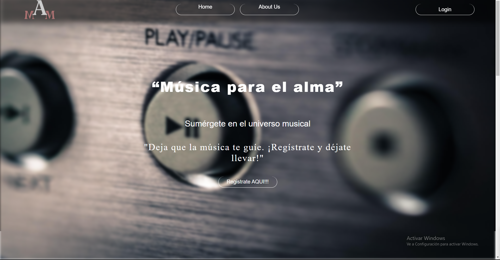
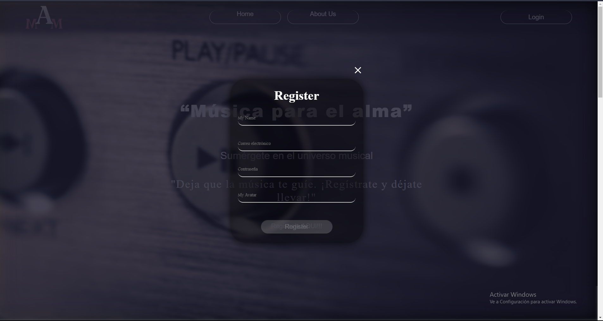
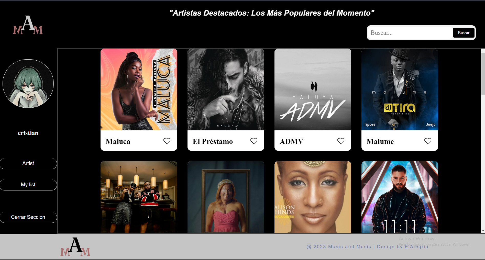

# Proyecto de Música Similar a Spotify

## Descripción del Proyecto
Este es un emocionante proyecto de música desarrollado utilizando tecnologías modernas. Nuestra plataforma te permite explorar y disfrutar de la música de una manera única.

## Tecnologías Utilizadas
- JavaScript (JSx)
- CSS con Media Queries
- React para componentes interactivos
- Animaciones para una experiencia atractiva
- Integración de una API para obtener música

## Capturas de Pantalla

## Características Clave
- Explora una amplia biblioteca de canciones y álbumes.
- Crea y gestiona tus listas de reproducción personalizadas.
- Disfruta de una experiencia de usuario fluida y atractiva.
- Busca tu musica preferida y sumergete en ella.

## Instalación
1. Clona este repositorio: `git clone https://github.com/tuusuario/tuproyecto.git`
2. Instala las dependencias: `npm install`
3. Inicia la aplicación: `npm start`

## Uso
1. Regístrate o inicia sesión en tu cuenta.
2. Explora y reproduce tu música favorita.
3. Crea y gestiona tus listas de reproducción personalizadas.

## Contribución
¡Apreciamos las contribuciones! Si deseas contribuir, sigue estos pasos:
1. Fork el proyecto.
2. Crea una nueva rama: `git checkout -b feature/nueva-caracteristica`
3. Haz tus cambios y haz commit: `git commit -m 'Agrega una nueva característica'`
4. Empuja la rama: `git push origin feature/nueva-caracteristica`
5. Envía una solicitud de extracción.

## Licencia
Este proyecto está bajo la Licencia MIT. Consulta el archivo [LICENSE](LICENSE) para obtener más detalles.

## Contacto
Si tienes preguntas o sugerencias, no dudes en ponerte en contacto con nosotros en [Cristian Alegria](abrahama.32v@gmail.com).

¡Esperamos que disfrutes de la música!
